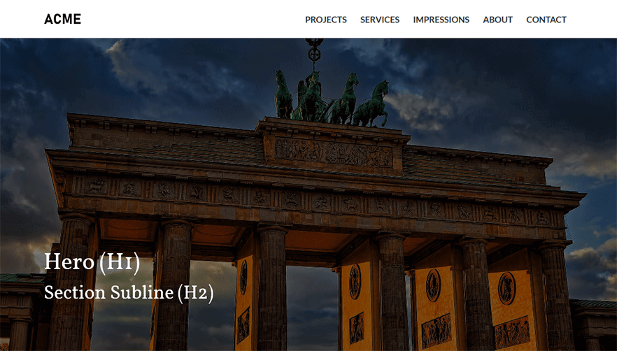

# Website Boilerplate

This is a basic website template to create static websites with bootstrap and other useful built-in scripts and snippets.


## Getting Started

### Prerequisites

Make sure you have installed [Git](https://git-scm.com/) and  [Node.js](https://nodejs.org) for your operating system.



### Installing

Clone the repository

```
git clone --depth 1 https://github.com/novusidea/static-website-boilerplate.git [MY-PROJECT]
```

Enter the folder

```
cd [MY-PROJECT]
```

Install nodejs dependencies

```
npm install
```

### Usage

Build Assets in development mode

```
npm run dev
```

Build Assets in production mode

```
npm run prod
```

Build Assets, open in browser and watch file changes

```
npm run watch
```

### Troubleshooting

If installing npm dependencies or building assets does not work, try the following:

```
rm -rf node_modules package-lock.json
npm cache clear --force
npm install
```

Further information at: [Laravel Mix](https://laravel-mix.com/docs/troubleshooting)

### TODOs
* Add maps section based on [Leaflet](https://leafletjs.com/) and use one of [OpenStreetMap Tile Layers](https://wiki.openstreetmap.org/wiki/Tile_servers)
* Add [Colors](https://clrs.cc) (look also in the footer for more tools)
